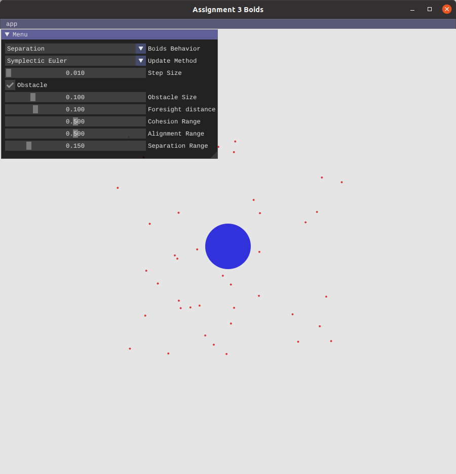

## Assignment 3 - Boids

## Introduction

In this assignment, I implement a particle system for simulating the behavior of birds based on *Boids*[[Reynolds(1987)]](https://medium.com/swlh/boids-a-simple-way-to-simulate-how-birds-flock-in-processing-69057930c229). A short introduction from the author is available [online](https://cs.stanford.edu/people/eroberts/courses/soco/projects/2008-09/modeling-natural-systems/boids.html).

Figure 1: Overview

As shown in Figure 1, different behaviors(*Freefall, Cohesion, Alignment, Separation, Leading*), integration schemes(*Explicit Euler, Symplectic Euler and Explicit midpoint) can be chosen from the interface. You can also set different parameters to test the behavior of  boids.

If the embeded videos can not be played well, you can check them in corresponding Youtube link or in the folder */videos.*

## Basic Time Integration
### freefall
Boids are randomly initiallized and then fall down because of velocity.
<iframe 
    src="https://youtu.be/qYt27zo-Buo"
    width="800" 
    height="450" 
    frameborder="0" 
    allowfullscreen>
</iframe>
### Circlular motion
In this case, 
To test the performance of different integration schemes,  I implemtent circular  motion around the origin. 

<iframe 
    src=""
    width="800" 
    height="450" 
    frameborder="0" 
    allowfullscreen>
</iframe>

